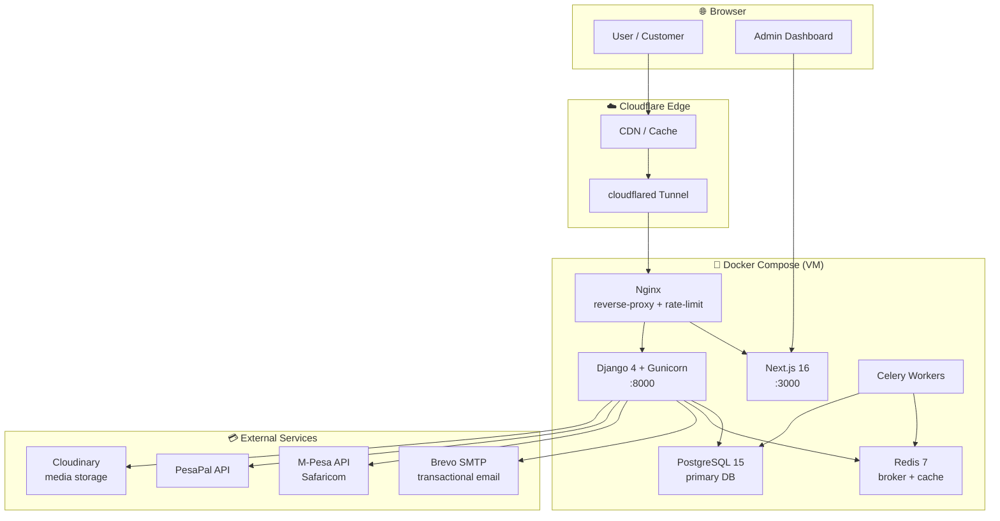
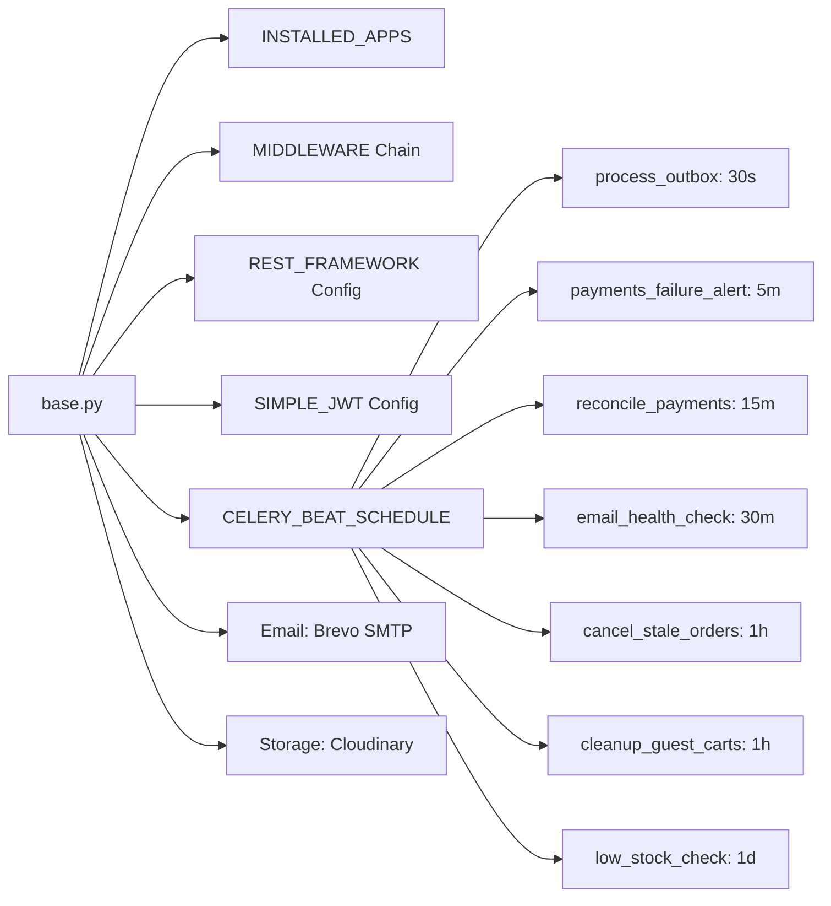
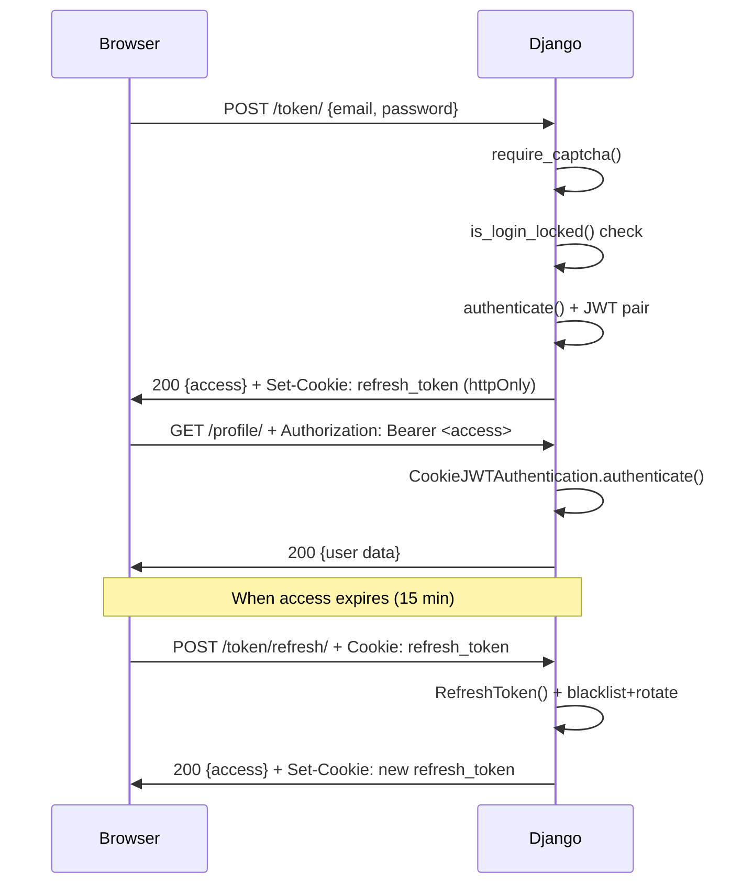
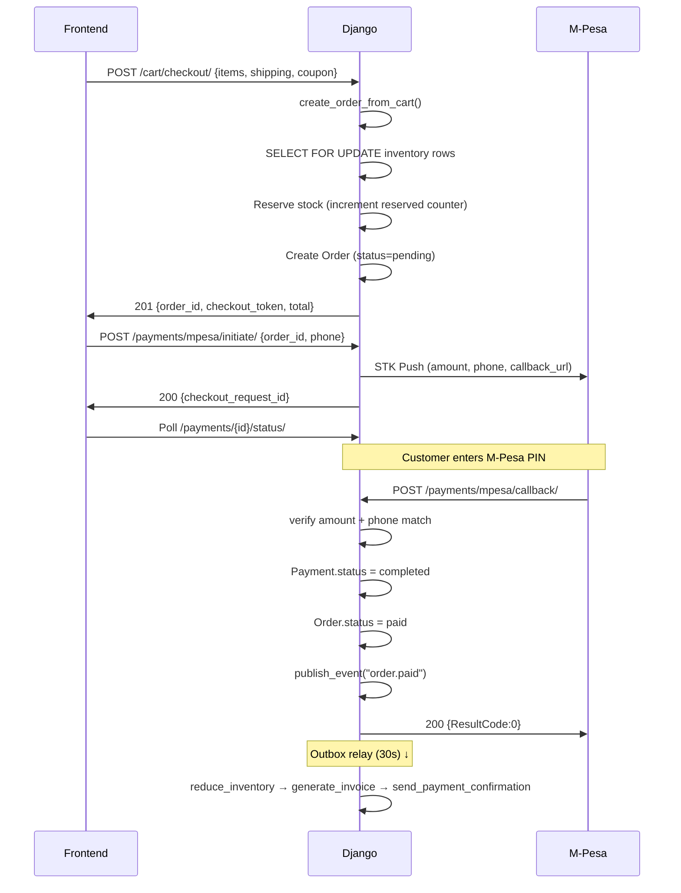
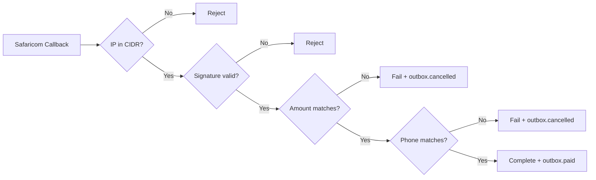
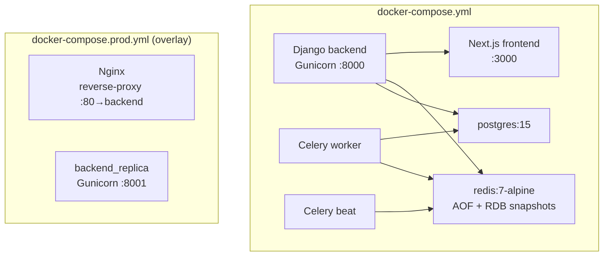
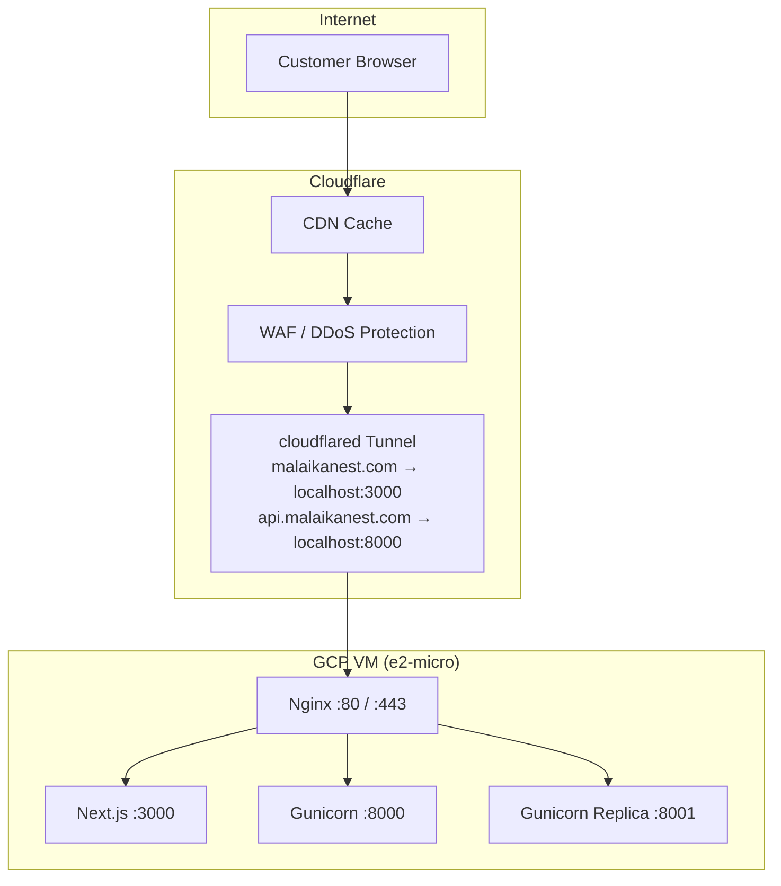
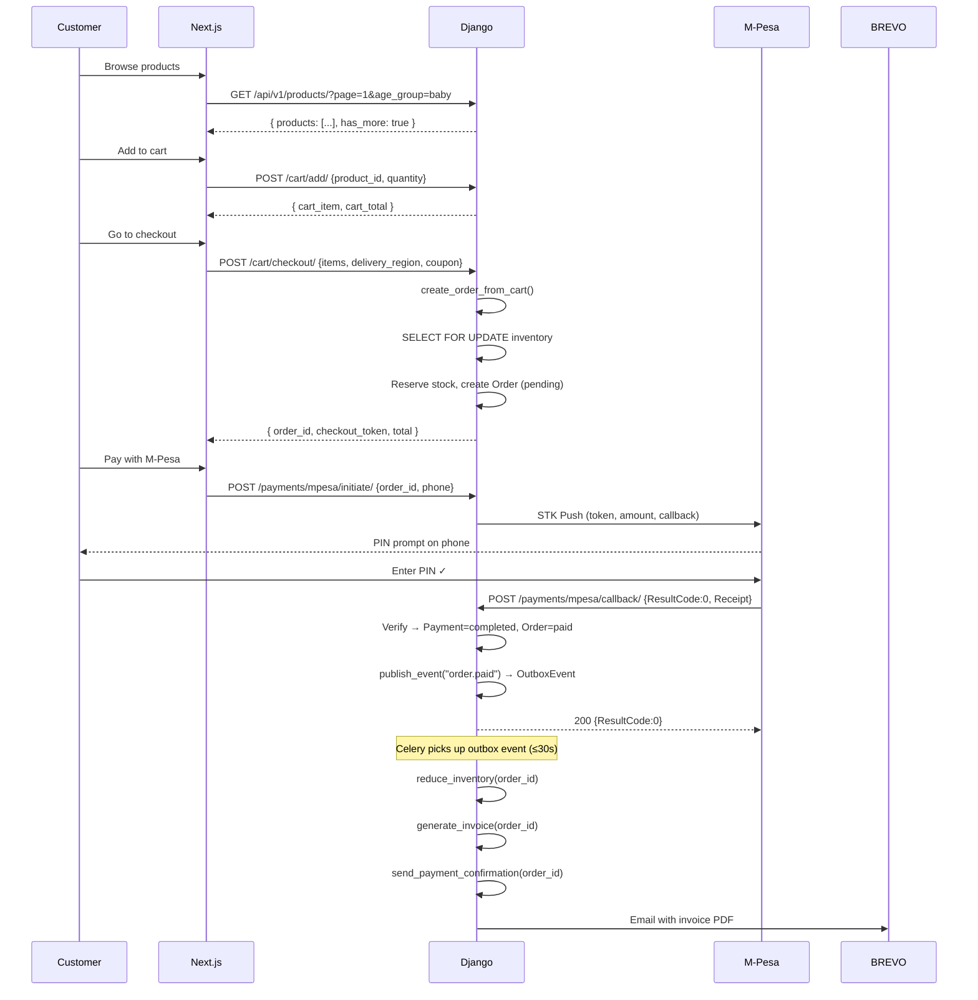
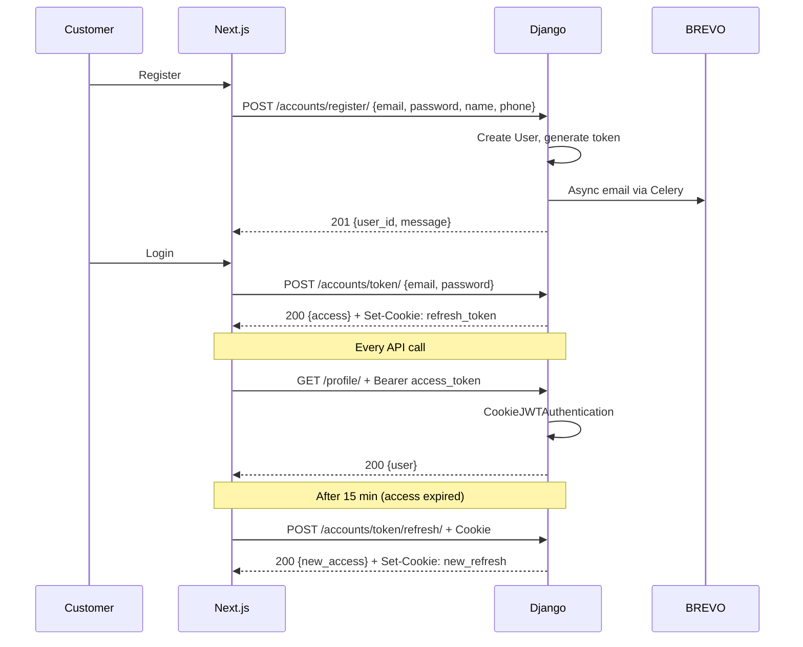

# 🏗️ Malaika Nest — Complete Architecture Map

> **Purpose:** One document that maps the *entire* codebase — backend, frontend, deployment, data flow — so you understand where every file lives, how they connect, and where to make surgical changes.
>
> Open this in Obsidian for [[wikilink]] navigation. Use the Mermaid diagrams as a visual compass.
>
> **Current state (2026-08-05):** Production-ready. TypeScript clean (`tsc --noEmit` → 0 errors,
> strict mode, no `@ts-ignore`). ESLint clean (0 problems). `next build` passes with
> `ignoreBuildErrors: false` (63 pages). See `docs/BUG-FIXES-2026-08-05.md` and `AGENTS.md`
> (repo root) for onboarding. Obsidian MOC: `Malaika Nest.md` in the vault.

---

## 🧭 High-Level Stack



---

## 📁 Project Root

```
malaikanest/
├── backend/          ← Django + Celery + DRF API
├── frontend/         ← Next.js 16 + Tailwind + shadcn/ui
├── deployment/       ← Systemd units, nginx configs, infra scripts
├── docs/             ← Architecture, plans, specs
├── docker-compose.yml
├── docker-compose.prod.yml
├── deploy.sh         ← Bare-metal deployment script
└── quick-deploy.sh   ← PM2-based deployment
```

---

# 1️⃣ Backend — Django 4 (`backend/`)

## 1.1 Configuration

| File | Role |
|---|---|
| `config/settings/base.py` | All settings: DB, Redis, Celery, CORS, JWT, email, throttling, storage |
| `config/settings/prod.py` | Production overrides (DEBUG=False, secure cookies, SSL) |
| `config/urls.py` | Root URL routing: `/api/v1/` → apps, `/api/` → legacy, `/manage-store/` → admin |
| `config/wsgi.py` | WSGI entrypoint for Gunicorn |
| `config/asgi.py` | ASGI entrypoint for Channels (WebSocket support) |

### Key Settings



### Middleware Pipeline (order matters)

```mermaid
graph LR
    A[GZipMiddleware] --> B[SecurityMiddleware]
    B --> C[SecurityHeadersMiddleware]
    C --> D[SessionMiddleware]
    D --> E[CorsMiddleware]
    E --> F[CommonMiddleware]
    F --> G[CsrfViewMiddleware]
    G --> H[AuthMiddleware]
    H --> I[IdempotencyMiddleware]
    I --> J[RateLimitMiddleware]
    J --> K[RequestLoggingMiddleware]
```



### Throttle Rates

| Scope | Rate |
|---|---|
| `anon` | 1200/hour |
| `user` | 5000/hour |
| `login` | 5/minute |
| `register` | 2/hour |
| `payments` | 10/minute |
| `password_reset` | 5/hour |
| `cart` | 60/minute |
| `order` | 20/minute |
| `resend_verification` | 3/hour |

---

## 1.2 Django Apps

### 🔐 `apps/accounts` — Authentication & User Management

**Models:**
```
User (AbstractBaseUser, PermissionsMixin)
  ├── email, phone_number, full_name, first_name, last_name
  ├── role (customer / admin / manager)
  ├── is_email_verified, verification_token, verification_token_expires
  ├── password_reset_token, password_reset_expires
  ├── token_version (incremented on logout-everywhere / password change)
  └── is_active, is_staff
UserAddress (BaseModel)
  └── user FK, address fields, is_default
```

**Views & Endpoints:**
```
POST   /api/v1/accounts/register/              → RegisterView
POST   /api/v1/accounts/verify-email/          → verify_email_view
POST   /api/v1/accounts/resend-verification/   → resend_verification_view
POST   /api/v1/accounts/token/                 → CookieTokenObtainPairView (login)
POST   /api/v1/accounts/token/refresh/         → CookieTokenRefreshView
POST   /api/v1/accounts/admin/login/           → AdminCookieTokenObtainPairView
GET    /api/v1/accounts/admin/session/         → admin_session_view
GET    /api/v1/accounts/profile/               → ProfileView (retrieve/update)
POST   /api/v1/accounts/logout/                → logout_view
POST   /api/v1/accounts/password/reset/        → password_reset_request_view
POST   /api/v1/accounts/password/reset/confirm/→ password_reset_confirm_view
POST   /api/v1/accounts/google/                → google_auth_view
```

**Services:**
```
AuthService
  ├── register_user()       → creates user, dispatches verification email
  ├── send_verification_email() → via EmailService
  ├── verify_email()        → validates token, activates account
  ├── resend_verification_email()
  ├── request_password_reset() → via EmailService
  └── confirm_password_reset() → validates token, changes password
```

**Authentication Flow:**


**Celery Tasks:**
```
send_verification_email_task(email, verify_url, first_name)
```

---

### 🛒 `apps/orders` — Orders, Cart, Invoicing

**Models:**
```
Cart (BaseModel)
  ├── user FK (nullable for guests)
  ├── session_key (guest identifier)
  ├── coupon FK, delivery_region
  └── items → CartItem[]

CartItem (BaseModel)
  ├── cart FK, product FK, variant FK (nullable)
  ├── quantity, unit_price
  └── UniqueConstraint: (cart, product) or (cart, variant)

Order (BaseModel) — State Machine
  ├── user FK (nullable for guests)
  ├── subtotal, discount_amount, delivery_fee, tax_amount, total
  ├── status: pending → initiated → paid → processing → shipped → delivered
  │                        ↓                      ↓           ↓
  │                   payment_failed          cancelled   refunded
  ├── paid_at, processed_at, shipped_at, delivered_at, cancelled_at
  ├── receipt_number (MN-XXXXXXXXXXXX)
  ├── checkout_token (unguessable per-order token)
  ├── coupon FK
  ├── shipping_address fields (first_name, last_name, phone, address, city, region, postal)
  ├── billing_address fields
  ├── payment_method, transaction_id, mpesa_receipt_number
  ├── inventory_restored (idempotency flag)
  ├── tracking_number, shipping_carrier
  └── items → OrderItem[]

OrderItem (BaseModel)
  ├── order FK, product FK
  ├── variant_reference, variant_details (JSON)
  ├── price, quantity
  └── __str__: "ProductName (Color) x Qty"

Invoice (BaseModel)
  ├── order (OneToOne), invoice_number (INV-YYYY-XXXXXX)
  ├── pdf_file (Cloudinary/Filesystem), pdf_url
  └── sent_at, download_count

Coupon (BaseModel)
  ├── code, discount_type (flat/percentage), discount_value
  ├── min_order_value, max_uses, used_count
  ├── valid_from, valid_to, is_active
  └── calculate_discount(subtotal) → Decimal

DeliveryZone (BaseModel)
  └── slug, name, fee, estimated_days, is_active, position
```

**Views & Endpoints:**
```
GET    /api/v1/orders/                        → OrderViewSet (list)
POST   /api/v1/orders/                        → OrderViewSet (create)
GET    /api/v1/orders/{id}/                    → OrderViewSet (retrieve)
PATCH  /api/v1/orders/{id}/                   → OrderViewSet (partial update)
GET    /api/v1/orders/cart/                   → CartViewSet.list
POST   /api/v1/orders/cart/add/               → CartViewSet.add
POST   /api/v1/orders/cart/update/            → CartViewSet.update_item
POST   /api/v1/orders/cart/merge/             → CartViewSet.merge
POST   /api/v1/orders/cart/coupon/apply/      → CartViewSet.apply_coupon
POST   /api/v1/orders/cart/coupon/remove/     → CartViewSet.remove_coupon
POST   /api/v1/orders/cart/clear/             → CartViewSet.clear_cart
POST   /api/v1/orders/cart/checkout/          → CartViewSet.checkout
POST   /api/v1/orders/cart/remove/{id}/       → CartViewSet.remove
POST   /api/v1/orders/track/                  → GuestOrderTrackView
GET    /api/v1/orders/delivery-zones/         → DeliveryZonesView
```

**Admin Endpoints:**
```
GET    /api/v1/orders/admin/analytics/        → sales metrics
GET    /api/v1/orders/admin/reports/          → reporting data
GET    /api/v1/orders/admin/carts/            → abandoned carts list
POST   /api/v1/orders/admin/carts/remind/     → send cart reminders
GET    /api/v1/orders/admin/orders/export/    → CSV export
GET    /api/v1/orders/admin/invoices/         → invoice list
GET    /api/v1/orders/admin/invoices/{id}/    → invoice detail
GET    /api/v1/orders/admin/invoices/{id}/download/
POST   /api/v1/orders/admin/invoices/{id}/regenerate/
POST   /api/v1/orders/admin/invoices/{id}/resend/
```

**Services:**
```
OrderService
  ├── process_checkout()  → lock inventory, create Order, reserve stock
  ├── cancel_order()      → transition + inventory restore
  └── retry_payment()     → re-initiate payment for failed orders
```

**Celery Tasks:**
```
send_order_confirmation(order_id)
send_payment_confirmation(order_id)
send_order_shipped(order_id)
send_order_delivered(order_id)
send_review_request(order_id)
send_abandoned_cart_reminder()
send_critical_alert(alert_type, message, context)
generate_invoice(order_id)
resend_invoice_email(order_id)
reduce_inventory(order_id)
restore_inventory(order_id)
cancel_stale_pending_orders()
cleanup_old_guest_carts()
process_failed_task(task_name, args, kwargs, error)
route_to_dlq (signal handler — dead-letter queue)
```

**State Machine — Status → Events:**
```
pending  → paid  → reduce_inventory + generate_invoice + send_payment_confirmation
paid     → processing → (no email)
processing → shipped → send_order_shipped
shipped  → delivered → send_order_delivered + schedule review request (3 days)
paid     → cancelled → restore_inventory
```

**Checkout Flow:**


---

### 💳 `apps/payments` — M-Pesa, PesaPal, Cards

**Models:**
```
Payment (BaseModel)
  ├── order FK, user FK (nullable)
  ├── amount, phone, payment_method (mpesa/pesapal/card)
  ├── status (initiated/completed/failed/refunded)
  ├── mpesa_checkout_request_id, mpesa_receipt_number
  ├── pesapal_tracking_id, pesapal_order_tracking_id
  ├── raw_callback (JSON), callback_received_at, completed_at
  └── error_message

PaymentAuditLog (BaseModel)
  ├── payment FK, event_type, source (api/celery)
  ├── payload_hash, payload (JSON), request_ip
  ├── checkout_request_id, merchant_request_id, result_code
  └── notes
```

**Views & Endpoints:**
```
POST   /api/v1/payments/initiate/            → InitiatePaymentView
POST   /api/v1/payments/mpesa/stk/           → MpesaSTKPushView
POST   /api/v1/payments/mpesa/pay/           → MpesaInitiateAndPushView
POST   /api/v1/payments/mpesa/initiate/      → MpesaInitiateView
POST   /api/v1/payments/mpesa/callback/      → MpesaCallbackView (from Safaricom)
GET    /api/v1/payments/{id}/status/         → PaymentStatusByIdView
GET    /api/v1/payments/verify/{id}/          → PaymentVerifyView
POST   /api/v1/payments/pesapal/initiate/    → PesapalInitiateView
GET    /api/v1/payments/pesapal/callback/    → PesapalCallbackView
GET    /api/v1/payments/pesapal/ipn/          → PesapalIPNView (IPN from PesaPal)
```

**Services:**
```
PaymentService
  ├── get_mpesa_oauth_token()    → cached (55 min TTL)
  ├── initiate_mpesa_stk()       → STK push + circuit breaker
  ├── process_callback()         → verify signature IP phone amount + outbox event
  ├── complete_mock_mpesa_payment() → dev mode
  └── trigger_post_payment_tasks() → invoice + inventory + email via outbox

Helper functions:
  ├── verify_mpesa_signature()   → RSA-SHA256
  ├── is_valid_mpesa_ip()        → Safaricom egress CIDR check
  ├── normalize_phone()          → 254XXXXXXXXX format
  ├── is_placeholder_secret()    → detect dummy creds
  └── audit_log()                → PaymentAuditLog
```

**Celery Tasks:**
```
verify_mpesa_payment_async(payment_id)    → query STK status + reconcile
verify_pesapal_payment_async(payment_id)  → query PesaPal status
reconcile_payments_task()                → batch reconcile stale payments
```

**M-Pesa Security:**


---

### 📦 `apps/products` — Products & Inventory

**Models:**
```
Brand (BaseModel)       → name, slug, description, image, is_active
Category (BaseModel)    → name, slug, parent FK, image, is_active
Tag (BaseModel)         → name, slug
Banner (BaseModel)      → title, image, link, position, is_active
Product (BaseModel)
  ├── name, slug, description, price, compare_price, cost_price
  ├── stock (denormalized), sku, barcode
  ├── brand FK, category FK, tags M2M
  ├── images → ProductImage[]
  ├── variants → ProductVariant[]
  ├── is_active, is_featured, is_thrifted
  └── age_group, gender, material, care_instructions
ProductImage (BaseModel) → product FK, image, alt_text, is_primary, position
ProductVariant (BaseModel) → product FK, color, size, price_modifier, sku, is_active
Inventory (BaseModel)
  └── product FK (OneToOne), quantity, reserved, low_stock_threshold
VariantInventory (BaseModel)
  └── variant FK (OneToOne), quantity, reserved
InventoryLog (BaseModel) → product FK, change, reason, order FK
Review (BaseModel)
  ├── product FK, user FK, order FK (for verified purchases)
  ├── rating (1-5), text, is_approved
  └── UniqueConstraint: (product, user, order) for verified
Wishlist (BaseModel)
  └── user FK, product FK, created_at (unique: user + product)
```

**Views & Endpoints (via ViewSet + router):**
```
GET    /api/v1/products/              → list (paginated 24, filterable)
GET    /api/v1/products/{slug}/       → retrieve by slug
GET    /api/v1/products/categories/    → category list
GET    /api/v1/products/banners/       → active banners
```

**Celery Tasks:**
```
low_stock_check(threshold=10)  → alert admin when stock runs low
```

---

### ⚙️ `apps/core` — Shared Infrastructure

**Models:**
```
BaseModel (abstract)
  ├── id = UUIDField(primary_key, default=uuid4)
  ├── created_at (auto_now_add)
  └── updated_at (auto_now)

SiteSettings (singleton)
  └── site_name, description, contact_email, phone, address, social links, shipping config, logo

ShopPhoto (BaseModel)
  └── image, image_url (Cloudinary), caption, is_active, position

OutboxEvent (BaseModel)  ← Transactional Outbox pattern
  ├── aggregate_type (order/payment), aggregate_id, event_type
  ├── payload (JSON), status (pending/published/failed)
  └── published_at

EmailLog (BaseModel)  ← Every email send is logged here
  ├── email_type, recipient, subject, template_name
  ├── success, duration_ms, error_message, order_id
  └── indexes: created_at, type+date, success+date
```

**Middleware:**
```
SecurityHeadersMiddleware  → CSP, HSTS, X-Frame-Options
RateLimitMiddleware        → Redis-backed per-IP rate limiting
RequestLoggingMiddleware   → Logs every request method+path+status+duration
IdempotencyMiddleware      → Idempotency-Key header support
```

**Renderers & Exceptions:**
```
StandardJSONRenderer
  └── wraps ALL responses: { status: "success", data: ... }
custom_exception_handler
  └── wraps errors: { status: "error", error: { message, code, details } }
```

**Core Endpoints:**
```
GET  /api/health/              → HealthCheckView (DB + Redis check)
GET  /api/v1/core/settings/    → SiteSettingsView (admin)
GET  /api/v1/core/settings/public/ → PublicSettingsView
POST /api/v1/core/contact/     → ContactFormView
GET  /api/v1/core/logs/        → Pm2LogsView (PM2 log access)
GET  /api/v1/core/shop-photos/ → ShopPhotosView
```

**Celery Tasks:**
```
process_outbox()              → relay OutboxEvents (30s)
payments_failure_alert()      → RED alert on M-Pesa failure spike (5m)
email_health_check()          → test SMTP + alert on failure (30m)
```

**Infrastructure:**
```
Circuit Breaker (apps/core/circuit_breaker.py)
  └── Prevents cascading failures when M-Pesa/PesaPal are down

Metrics (apps/core/metrics.py)
  └── Redis counters for payments.completed, payments.failed

Captcha (apps/core/captcha.py)
  └── Google reCAPTCHA integration for login/register
```

---

### 👤 `apps/users` — Legacy/Superseded

> ⚠️ **Dead code.** `apps/users` duplicates `apps/accounts` functionality and is no longer wired into the active URL routes. Remove after confirming no external integrations reference it.

---

## 1.3 Email Service (`apps/core/email_service.py`)

Centralised email dispatch used by ALL senders:

```
EmailService.send(email_type, to, subject, template_name, context, attachments, invoice)
  → render_to_string(template) → HTML body
  → strip_tags(HTML) → plain text
  → EmailMultiAlternatives(subject, text, from, to) + attach_alternative(HTML)
  → attach invoice PDF if provided
  → msg.send()
  → EmailLog.create(success/fail + duration_ms)
  → return (success, message)

Convenience methods:
  ├── send_verification(email, verify_url, first_name)
  ├── send_password_reset(email, reset_url)
  ├── send_order_confirmation(order)
  ├── send_payment_confirmation(order, invoice)
  ├── send_order_shipped(order)
  ├── send_order_delivered(order)
  ├── send_review_request(order)
  ├── send_abandoned_cart(email, items, total, first_name)
  ├── send_invoice(order, invoice)
  └── send_critical_alert(alert_type, message, context)
```

**Email Templates** (all extend `emails/base_email.html`):
```
base_email.html          ← shared: card, gold bar, divider, footer, disclaimer
├── verify_email.html         ← "MN" badge, verify button
├── payment_confirmation.html ← sage checkmark, order summary, invoice text
├── order_confirmation.html   ← dark gradient header, order details table
├── order_shipped.html        ← truck icon, tracking info
├── order_delivered.html      ← green accent bar, review CTA
├── abandoned_cart.html       ← cart items with thumbnails
└── review_request.html       ← product list, star rating CTA
```

---

# 2️⃣ Frontend — Next.js 16 (`frontend/`)

## 2.1 Tech Stack

```
Next.js 16             ← App Router, React 19
TypeScript 5
Tailwind CSS v4         ← utility-first + CSS variables for branding
shadcn/ui              ← primitives (dialog, sheet, button, etc.)
Lucide React           ← icon library
Prisma 6               ← SQLite client for admin CMS
Axios                  ← HTTP client for Django API
Recharts               ← admin charts
Sonner                 ← toast notifications
next-intl              ← i18n (English + Swahili)
```

## 2.2 Route Structure

### Store Front (`(store)/`)
```
/                       → Homepage (hero, categories, featured, testimonials, newsletter)
/about                  → About page
/blog                   → Blog list
/blog/[slug]            → Blog post
/best-sellers           → Best sellers
/cart                   → Shopping cart
/categories             → Category listing + filters
/checkout               → Checkout form
/checkout/success       → Order success page
/contact                → Contact form
/faq                    → FAQ
/find-us                → Store locator
/forgot-password        → Password reset request
/login                  → Login
/register               → Registration
/products/[slug]        → Product detail (error + loading states)
/reset-password         → Password reset confirm
/search                 → Search results
/shipping               → Shipping info
/thrifted               → Thrifted items
/thrifted/[slug]        → Thrifted item detail
/track                  → Order tracking
/wishlist               → Wishlist
/account                → Account dashboard
/account/orders         → Order history
/account/orders/[id]    → Single order detail
/account/loyalty        → Loyalty program
/privacy-policy         → Privacy
/returns                → Returns policy
/terms-of-service       → Terms
```

### Admin (`admin/`)
```
/admin/                 → Dashboard
/admin/login            → Admin login
/admin/products         → Product list CRUD
/admin/products/new     → Create product
/admin/products/[id]    → Edit product
/admin/categories       → Category management
/admin/banners          → Banner management
/admin/orders           → Order management
/admin/customers        → Customer list
/admin/coupons          → Coupon management
/admin/invoices         → Invoice management
/admin/blog             → Blog posts
/admin/blog/new         → New post
/admin/blog/[id]        → Edit post
/admin/branding         → Site branding
/admin/content          → Homepage content blocks
/admin/testimonials     → Testimonial CRUD
/admin/thrifted         → Thrifted items
/admin/thrifted/new     → New thrifted
/admin/thrifted/[id]    → Edit thrifted
/admin/reports          → Sales reports
/admin/settings         → Site settings
/admin/abandoned-carts  → Abandoned cart management
/admin/loyalty          → Loyalty config
```

## 2.3 App Layout Hierarchy

```
app/layout.tsx              ← Root: Providers, fonts, globals.css
├── app/(store)/layout.tsx  ← Store shell: navbar, footer, bottom nav, cart context
│   ├── page.tsx (and all store pages)
│   └── app/error.tsx       ← Global error boundary
└── app/admin/layout.tsx    ← Admin shell: sidebar, header, auth guard
    └── (all admin pages)
```

**Providers chain** (in `app/layout.tsx`):
```
I18nProvider
  └── AuthProvider
       └── CartProvider
            └── WishlistProvider
                 └── CategoriesProvider
```

## 2.4 Components

### Malaika Store Components (`components/malaika/`)
```
navbar.tsx              ← Main nav (desktop + mobile), search, auth state, cart icon
footer.tsx              ← Site footer with links, social, newsletter
hero.tsx                ← Homepage hero with banner rotation
product-card.tsx        ← Product card for grids
product-section.tsx     ← Homepage product section (heading + grid)
category-quick-links.tsx ← Homepage category navigation
shop-by-age.tsx         ← Age-group selector (0-3m, 3-6m, etc.)
value-props.tsx         ← Trust badges (Safe Materials, Fast Delivery, etc.)
testimonials.tsx        ← Customer testimonials carousel
newsletter.tsx          ← Email newsletter signup
recently-viewed-section.tsx ← Recently viewed products
related-products.tsx    ← Related products on PDP
review-section.tsx      ← Product reviews on PDP
thrifted-section.tsx    ← Thrifted items section
thrifted-card.tsx       ← Thrifted item card
announcement-bar.tsx    ← Top announcement bar
cart-recovery-banner.tsx ← Abandoned cart recovery CTA
cookie-consent.tsx      ← GDPR cookie consent banner
language-toggle.tsx     ← EN/SW language switcher
logo.tsx                ← Malaika Nest logo
mobile-bottom-nav.tsx   ← Mobile bottom navigation (5 items: Home, Shop, Cart, Account, Search)
store-shell.tsx         ← Shared store layout wrapper
scroll-to-top.tsx       ← Scroll-to-top FAB
whatsapp-button.tsx     ← Floating WhatsApp CTA
providers.tsx           ← Combined providers wrapper
```

### UI Library (`components/ui/`) — shadcn primitives
```
dialog, sheet, drawer, popover, tooltip, dropdown-menu, command, context-menu
button, input, label, textarea, select, checkbox, radio-group, switch, slider
card, table, badge, avatar, skeleton, separator, accordion, tabs, carousel
calendar, progress, pagination, toast, toaster, alert, alert-dialog, hover-card
breadcrumb, collapsible, navigation-menu, menubar, resizable, scroll-area
sidebar, sonner, toggle, toggle-group, chart, input-otp, form, aspect-ratio
```

## 2.5 State Management & Lib

### Context Providers (`lib/`)
```
authContext.tsx       ← login(), register(), logout(), checkAuth(), user state, token refresh
cartContext.tsx       ← cart items, add/remove/update/merge/checkout, coupon, delivery zone
wishlistContext.tsx   ← wishlist items, toggle
categoriesContext.tsx ← product categories cache
i18n.tsx             ← internationalization (EN + SW)
```

### API & Data (`lib/`)
```
api.ts               ← axios instance with interceptors (auth, refresh, error extraction)
authToken.ts         ← in-memory access token storage + refresh queue
toast.ts             ← toast notification helper
products.ts          ← product API calls + normalization
catalog.ts           ← catalog search/filter
blog.ts              ← blog API calls
cartRecovery.ts      ← abandoned cart detection + recovery link
categories.ts        ← category API calls
delivery.ts          ← delivery zone API + fee calculation
recently-viewed.ts   ← localStorage-based recently viewed
related-products.ts  ← related products API
media.ts             ← media/image helpers
public-settings.ts   ← public site settings API
settings.ts          ← admin settings API
shop-photos.ts       ← shop photos API
site-config.ts       ← site configuration (metadata, SEO)
thrifted.ts          ← thrifted items API
utils.ts             ← cn() classname merger + general helpers
db.ts                ← Prisma client singleton
icons.ts             ← icon helper
```

## 2.6 Brand Design System

Defined in `app/globals.css` as CSS custom properties:

```
--brand-cream:        #FDF3EA   (warm cream backgrounds)
--brand-cream-dark:   #F5E6D3   (darker cream for page bg)
--brand-gold:         #C8956C   (primary accent — buttons, links)
--brand-gold-dark:    #B07D5A   (hover state)
--brand-gold-light:   #E8D5C0   (light variant)
--brand-gold-soft:    #DEC9B0   (decorative dots)
--brand-brown:        #5C3A21   (secondary text, strong accents)
--brand-text:         #2D1810   (headings, body)
--brand-text-secondary: #6B4A3A (subtitles)
--brand-text-muted:   #8B7A6A   (labels, hints)
--brand-warm:         #EDDCC8   (hover backgrounds)
--brand-border:       #E5D5C0   (borders, dividers)
--brand-terra:        #9B6B4B   (terracotta accent)
--brand-terra-soft:   #D4B8A0   (terracotta light)
--brand-green:        #7A8E6B   (sage green — success)
--brand-success:      #7A8E6B   (success state)
--brand-bg-alt:       #FDF3EA   (alternate background)
```

Fonts: **Cormorant Garamond** (serif, display) + **DM Sans** (sans-serif, body).

---

# 3️⃣ Infrastructure & Deployment

## 3.1 Docker Compose Architecture



## 3.2 Production VM (GCP e2-micro)

```
1 GB RAM, 30 GB disk, 2 vCPUs
Ubuntu 22.04 LTS
4 GB swap (setup-swap-and-tuning.sh)

Services:
  ├── Gunicorn (Django)     ← 2 workers, socket-activated
  ├── Gunicorn replica       ← 2 workers, socket-activated (SPOF fix)
  ├── Celery worker          ← 1 worker, prefetch=1, acks_late
  ├── Celery beat            ← scheduler
  ├── Redis 7                ← AOF + RDB persistence
  ├── Nginx                  ← reverse proxy, rate limiting, caching
  ├── cloudflared            ← Cloudflare Tunnel
  └── Next.js (PM2)          ← managed by PM2, port 3000
```

## 3.3 Deployment Scripts

| Script | Purpose |
|---|---|
| `deploy.sh` | Full bare-metal: pull code, run migrations, restart services |
| `quick-deploy.sh` | PM2-based quick deploy |
| `deploy.ps1` | Windows deployment (dev) |
| `deploy_frontend.js` | Deploy frontend build to VM |
| `deploy_now.js` | Immediate deploy without full cycle |
| `sync_build_to_vm.js` | Rsync frontend build to VM |
| `update_remote_backend.js` | Sync backend code to VM |
| `patch_frontend_container.js` | Rebuild + restart frontend Docker |
| `patch_and_deploy.js` | Fast patch cycle |

### Systemd Services (`deployment/systemd/`)

```
gunicorn.service            ← backend WSGI
gunicorn-replica.service    ← backend replica (SPOF)
celery.service              ← Celery worker
celerybeat.service          ← Celery beat scheduler
redis.service               ← Redis
frontend.service            ← Next.js (PM2-managed)
```

### Nginx Configs

```
nginx-production.conf       ← Active: upstreams, SSL, rate limiting, proxy cache
nginx.prod.conf             ← Alternative config
nginx.conf                  ← Dev config
malaikanest-nginx.conf      ← Cloudflare-optimized with proxy_cache
malaikanest-ssl.fixed.conf  ← SSL-specific config
```

## 3.4 Network Topology



## 3.5 Rate Limiting (3 Layers)

```
Layer 1: Nginx
  ├── limit_req_zone $binary_remote_addr zone=login:10m rate=5r/m
  ├── limit_req_zone $binary_remote_addr zone=register:10m rate=2r/m
  └── limit_req_zone $binary_remote_addr zone=api:10m rate=30r/s

Layer 2: Django REST Framework throttling
  ├── AnonRateThrottle: 1200/hour
  ├── UserRateThrottle: 5000/hour
  └── Scoped: login 5/min, register 2/hour, payments 10/min, etc.

Layer 3: Custom RateLimitMiddleware (Redis-backed)
  └── Per-IP, per-path, configurable windows
```

---

# 4️⃣ Key Data Flows

## 4.1 Purchase Flow (End-to-End)



## 4.2 Authentication Flow



---

# 5️⃣ Database Schema

## 5.1 PostgreSQL (Django)

The Django ORM manages ~20 tables across 5 apps. Key relationships:

```
User 1──N UserAddress
User 1──N Order
User 1──N Review
User 1──1 Wishlist (per-product)

Product N──1 Brand
Product N──1 Category
Product N──M Tag
Product 1──N ProductImage
Product 1──N ProductVariant
Product 1──1 Inventory
Product 1──N InventoryLog
Product 1──N Review
Product 1──N Wishlist

ProductVariant 1──1 VariantInventory

Order 1──N OrderItem
Order 1──1 Invoice
Order N──1 Coupon
Order 1──N Payment

Cart 1──N CartItem
Cart N──1 Coupon

Payment 1──N PaymentAuditLog
```

## 5.2 SQLite (Prisma — Next.js CMS)

```
SiteSetting (key/value store for branding)
ContentBlock (section + key → value, for homepage text)
Testimonial (name, location, rating, text, photo)
ValueProp (icon, title, description)
BlogPost (title, slug, content, excerpt, image, published)
ThriftedProduct (name, price, description, images, sold)
```

---

# 6️⃣ File Inventory (Quick Reference)

## Backend — Key Files

```
config/settings/base.py           ← All settings in one place
config/urls.py                    ← Root URL routing
apps/accounts/views.py            ← Auth views (login, register, profile, etc.)
apps/accounts/services.py         ← AuthService (registration, verification, password reset)
apps/accounts/authentication.py   ← CookieJWTAuthentication (JWT cookie reader)
apps/accounts/security.py         ← Login locking, auth events, IP extraction
apps/accounts/serializers.py      ← RegisterSerializer, TokenObtainPairWithUserSerializer
apps/accounts/tasks.py            ← send_verification_email_task

apps/orders/models.py             ← Order (state machine), Cart, CartItem, Invoice, Coupon
apps/orders/views.py              ← CartViewSet, OrderViewSet, admin endpoints
apps/orders/services.py           ← OrderService (checkout, cancel, retry)
apps/orders/tasks.py              ← All email tasks, inventory tasks, stale order cleanup
apps/orders/serializers.py        ← Order/Cart serializers
apps/orders/invoice.py            ← PDF invoice generation (xhtml2pdf + reportlab)

apps/payments/models.py           ← Payment, PaymentAuditLog
apps/payments/views.py            ← MpesaCallbackView, Pesapal views
apps/payments/services.py         ← PaymentService (STK push, callback processing)
apps/payments/tasks.py            ← verify_mpesa, verify_pesapal, reconcile
apps/payments/pesapal.py          ← PesaPal API client

apps/products/models.py           ← Product, Category, Brand, Inventory, Review, etc.
apps/products/views.py            ← ProductViewSet (filtered, paginated listing)
apps/products/serializers.py      ← ProductSerializer (nested images, variants)

apps/core/models.py               ← BaseModel, SiteSettings, OutboxEvent, EmailLog
apps/core/tasks.py                ← process_outbox, email_health_check, payments_failure_alert
apps/core/email_service.py        ← EmailService (centralised email dispatch)
apps/core/middleware.py           ← SecurityHeaders, RateLimit, RequestLogging
apps/core/exceptions.py           ← custom_exception_handler
apps/core/renderers.py            ← StandardJSONRenderer
apps/core/circuit_breaker.py      ← Circuit breaker for M-Pesa/PesaPal
apps/core/metrics.py              ← Redis counters
apps/core/outbox.py               ← publish_event() helper
```

## Frontend — Key Files

```
src/app/layout.tsx                ← Root providers, fonts, metadata
src/app/(store)/layout.tsx        ← Store shell (navbar, footer, cart context)
src/app/(store)/page.tsx          ← Homepage
src/app/(store)/categories/page.tsx  ← Category listing + filters
src/app/(store)/products/[slug]/page.tsx  ← Product detail page
src/app/(store)/login/page.tsx    ← Login (redesigned: warm card, gold accents)
src/app/(store)/register/page.tsx ← Register (redesigned: warm card, all helpers)
src/app/(store)/cart/page.tsx     ← Shopping cart
src/app/(store)/checkout/page.tsx ← Checkout form
src/app/admin/page.tsx            ← Admin dashboard

src/components/malaika/navbar.tsx ← Navigation (responsive, search, auth)
src/components/malaika/footer.tsx ← Footer
src/components/malaika/hero.tsx   ← Hero carousel
src/components/malaika/product-card.tsx ← Product card

src/lib/api.ts                    ← Axios instance + interceptors
src/lib/authContext.tsx           ← Auth state + login/register/logout/refresh
src/lib/cartContext.tsx           ← Cart state + add/remove/checkout
src/lib/i18n.tsx                  ← Internationalization

src/app/globals.css               ← Brand tokens + Tailwind theme

prisma/schema.prisma              ← SQLite schema (CMS)
tailwind.config.ts                ← Tailwind + shadcn theme
next.config.ts                    ← Next.js configuration
```

---

# 7️⃣ Architecture Decisions Record

| Decision | Rationale |
|---|---|
| **Django + Next.js, not monolith** | Django for mature admin, ORM, DRF. Next.js for modern React, SSR, ISR. Separate deploy concerns. |
| **Cookie-based JWT** | httpOnly refresh cookie prevents XSS token theft. Access token in memory (not localStorage). Domain-scoped cookie works across subdomains. |
| **Transactional Outbox** | Prevents lost side effects (inventory, invoice, email) on process crash between DB commit and Celery enqueue. |
| **Circuit Breaker for M-Pesa** | Safaricom API sometimes degrades. Breaker prevents worker threads from hanging on dead API. |
| **M-Pesa IP whitelist + Signature verification** | Prevents forged callbacks from non-Safaricom IPs and ensures payload integrity. |
| **EmailService + EmailLog** | Centralises rendering, eliminates 10x duplicated `EmailMultiAlternatives` patterns, logs every send for audit. |
| **StandardJSONRenderer envelope** | Consistent `{ status, data }` / `{ status, error }` response format. Exception handler normalises errors. |
| **3-layer rate limiting** | Nginx (coarse), DRF (per-view), custom Redis middleware (fine-grained) — defence in depth without single point of failure. |
| **SSR with ISR for products** | Product pages rendered server-side for SEO, revalidated hourly for inventory/price changes. |
| **Cloudinary for media** | Offloads image serving, transforms, CDN from the e2-micro VM. |

---

> 💡 **Tip for surgical changes:** Use this document to find the exact file and function before editing. Most features involve a frontend page → API endpoint → service → model → task chain. Follow the chain from top to bottom.
